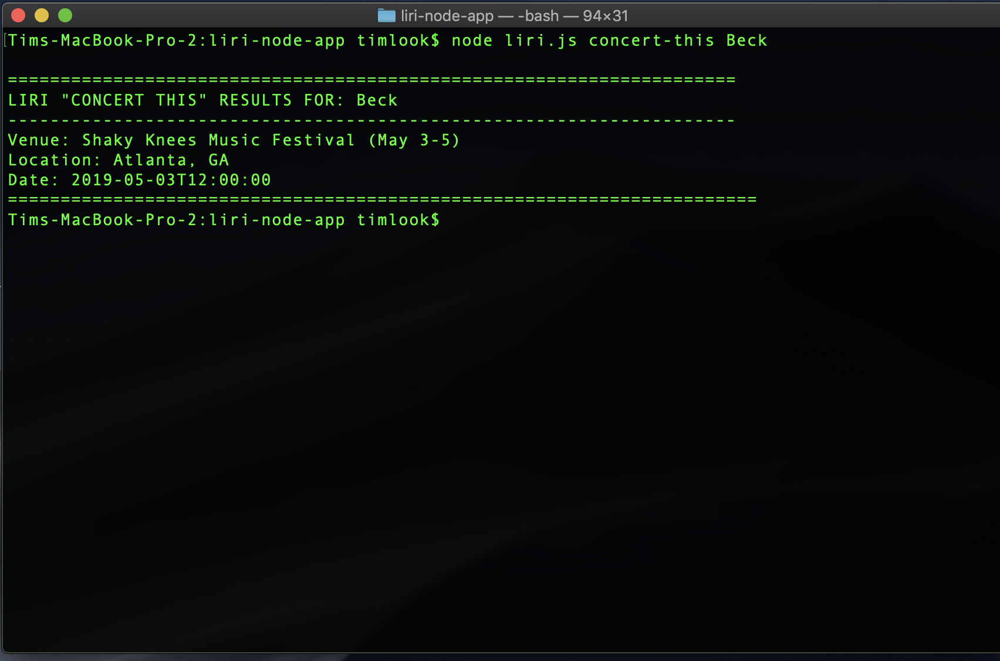

# liri-node-app

### Overview

For this assignment, I am supposed to make LIRI. LIRI is like iPhone's SIRI. However, while SIRI is a Speech Interpretation and Recognition Interface, LIRI is a _Language_ Interpretation and Recognition Interface. LIRI will be a command line node app that takes in parameters and gives you back data.

### Instructions to Use LIRI:

LIRI will search Spotify for songs, Bands in Town for concerts, and OMDB for movies.

1. In the CLI, navigate to the root folder of the Liri App.

2. Inside the root folder of LIRI type one of the following commands:

  * For the concert info on a band: `node liri.js concert-this '<artist/band name here>'`

  Example: This example uses the 'concert-this' function to search for the artist _Beck_.

  * For information about a specific song: `node liri.js spotify-this-song '<song name here>'`

  * for information about a specific movie: `node liri.js movie-this '<movie name here>'`

